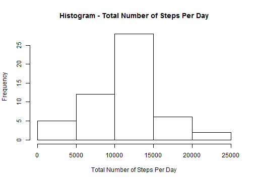
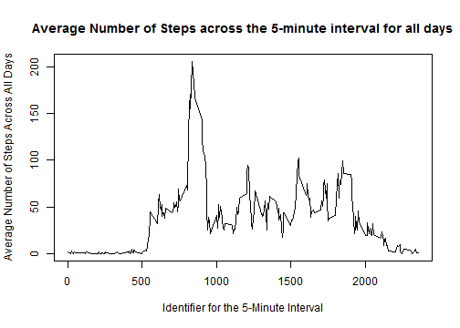
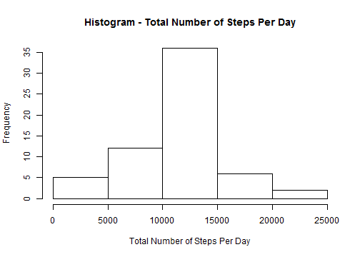
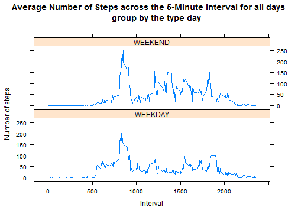

### Loading and preprocessing the data

Show any code that is needed to:

1. Load the data (i.e. read.csv())


```r
# Set R working directory and read in csv file
setwd("C:/Users/admin/Desktop/RWorkspace")
orig_activity <- read.csv("activity.csv")
```

2. Process/transform the data (if necessary) into a format suitable for your analysis.


```r
# Removing rows with with N.A. steps column
activity <- na.omit(orig_activity)
```

### What is mean total number of steps taken per day?

For this part of the assignment, you can ignore the missing values in the dataset.

1. Calculate the total number of steps taken per day


```r
# Extracting only the dates and number of steps columns
totalsteps <- activity[,1:2]
# Finding the total number of steps per day
library(plyr)
totalsteps <- ddply(totalsteps,.(date),numcolwise(sum, na.rm = TRUE))
totalsteps
```

```
##          date steps
## 1  2012-10-02   126
## 2  2012-10-03 11352
## 3  2012-10-04 12116
## 4  2012-10-05 13294
## 5  2012-10-06 15420
## 6  2012-10-07 11015
## 7  2012-10-09 12811
## 8  2012-10-10  9900
## 9  2012-10-11 10304
## 10 2012-10-12 17382
## 11 2012-10-13 12426
## 12 2012-10-14 15098
## 13 2012-10-15 10139
## 14 2012-10-16 15084
## 15 2012-10-17 13452
## 16 2012-10-18 10056
## 17 2012-10-19 11829
## 18 2012-10-20 10395
## 19 2012-10-21  8821
## 20 2012-10-22 13460
## 21 2012-10-23  8918
## 22 2012-10-24  8355
## 23 2012-10-25  2492
## 24 2012-10-26  6778
## 25 2012-10-27 10119
## 26 2012-10-28 11458
## 27 2012-10-29  5018
## 28 2012-10-30  9819
## 29 2012-10-31 15414
## 30 2012-11-02 10600
## 31 2012-11-03 10571
## 32 2012-11-05 10439
## 33 2012-11-06  8334
## 34 2012-11-07 12883
## 35 2012-11-08  3219
## 36 2012-11-11 12608
## 37 2012-11-12 10765
## 38 2012-11-13  7336
## 39 2012-11-15    41
## 40 2012-11-16  5441
## 41 2012-11-17 14339
## 42 2012-11-18 15110
## 43 2012-11-19  8841
## 44 2012-11-20  4472
## 45 2012-11-21 12787
## 46 2012-11-22 20427
## 47 2012-11-23 21194
## 48 2012-11-24 14478
## 49 2012-11-25 11834
## 50 2012-11-26 11162
## 51 2012-11-27 13646
## 52 2012-11-28 10183
## 53 2012-11-29  7047
```

2. Make a histogram of the total number of steps taken each day


```r
hist(totalsteps$steps, main="Histogram - Total Number of Steps Per Day", 
     xlab="Total Number of Steps Per Day")
```

 

3. Calculate and report the mean and median of the total number of steps taken per day


```r
# Finding the Mean
mean(totalsteps$steps)
```

```
## [1] 10766.19
```

The Mean of the total number of steps per day is 10766.19.


```r
# Finding the Median
median(totalsteps$steps)
```

```
## [1] 10765
```

The Median of the total number of steps per day is 10765.

### What is the average daily activity pattern?

1. Make a time series plot (i.e. type = "l") of the 5-minute interval (x-axis) and the average number of steps taken, averaged across all days (y-axis)


```r
# Extracting only the interval and steps columns
intervalsteps <- activity[,c(1,3)]
# Finding the mean of steps based on interval identifier
intervalsteps <- ddply(intervalsteps,.(interval),numcolwise(mean))
# Plot
plot(intervalsteps$interval,intervalsteps$steps, type = "l", 
     main="Average Number of Steps across the 5-minute interval for all days",
     xlab="Identifier for the 5-Minute Interval",
     ylab="Average Number of Steps Across All Days" )
```

 

2. Which 5-minute interval, on average across all the days in the dataset, contains the maximum number of steps?


```r
# Finding the interval with the maximum number of steps
intervalsteps[which.max(intervalsteps$steps),]
```

```
##     interval    steps
## 104      835 206.1698
```

Interval 835 contains the maximum number of steps.

### Imputing missing values

Note that there are a number of days/intervals where there are missing values (coded as NA). The presence of missing days may introduce bias into some calculations or summaries of the data.

1. Calculate and report the total number of missing values in the dataset (i.e. the total number of rows with NAs)


```r
# Finding the number of rows with NAs
sum(is.na(orig_activity))
```

```
## [1] 2304
```

2304 rows have missing values.

2. Devise a strategy for filling in all of the missing values in the dataset. The strategy does not need to be sophisticated. For example, you could use the mean/median for that day, or the mean for that 5-minute interval, etc.

Strategy: Fill the missing values with the average number of steps (mean) across all days for the respective 5-minuter interval identifier.

3. Create a new dataset that is equal to the original dataset but with the missing data filled in.


```r
# Filling up the rows with N.A. steps value
revised_activity <- orig_activity
i <- 1
for (i in seq (1,nrow(revised_activity),1)) {
  # If "steps" column is N.A.
  if (is.na(revised_activity[i,]$steps)==TRUE) {
    # Equate the N.A. by the previous dataset, intervalsteps, 
    # containing mean value of steps of that interval
    interval_id <- revised_activity[i,]$interval
    revised_activity[i,]$steps <- 
      intervalsteps[intervalsteps$interval==interval_id,]$steps
  }
}
rm(i,interval_id)
head(revised_activity)
```

```
##       steps       date interval
## 1 1.7169811 2012-10-01        0
## 2 0.3396226 2012-10-01        5
## 3 0.1320755 2012-10-01       10
## 4 0.1509434 2012-10-01       15
## 5 0.0754717 2012-10-01       20
## 6 2.0943396 2012-10-01       25
```

```r
sum(is.na(revised_activity))
```

```
## [1] 0
```

0 rows have missing values.

4. Make a histogram of the total number of steps taken each day and Calculate and report the mean and median total number of steps taken per day.


```r
# Extracting only the dates and number of steps columns
totalsteps <- revised_activity[,1:2]
# Finding the total number of steps per day
totalsteps <- ddply(totalsteps,.(date),numcolwise(sum))
hist(totalsteps$steps, main="Histogram - Total Number of Steps Per Day", 
     xlab="Total Number of Steps Per Day")
```

 


```r
# Finding the Mean
mean(totalsteps$steps)
```

```
## [1] 10766.19
```

The Mean of the total number of steps taken per day is 10766.19.


```r
# Finding the Median
median(totalsteps$steps)
```

```
## [1] 10766.19
```

The Median of the total number of steps taken per day is 10766.19.

5. Do these values differ from the estimates from the first part of the assignment? What is the impact of imputing missing data on the estimates of the total daily number of steps?

There is no change in the Mean but there is an increase in Median from 10765 to 10766.19 after imputing missing data.

### Are there differences in activity patterns between weekdays and weekends?

For this part the weekdays() function may be of some help here. Use the dataset with the filled-in missing values for this part.

1. Create a new factor variable in the dataset with two levels - "weekday" and "weekend" indicating whether a given date is a weekday or weekend day.


```r
# Load Library to manipulate date types
library(lubridate)
# Creating a new column $daytype to store the converted date
revised_activity$daytype <- wday(ymd(revised_activity$date))
revised_activity[revised_activity$daytype %in% c("1","2","3","4","5"),]$daytype <- "WEEKDAY"
revised_activity[revised_activity$daytype %in% c("6","7"),]$daytype <- "WEEKEND"
# Converting $daytype column to factor type
revised_activity$daytype <- as.factor(revised_activity$daytype)
str(revised_activity)
```

```
## 'data.frame':	17568 obs. of  4 variables:
##  $ steps   : num  1.717 0.3396 0.1321 0.1509 0.0755 ...
##  $ date    : Factor w/ 61 levels "2012-10-01","2012-10-02",..: 1 1 1 1 1 1 1 1 1 1 ...
##  $ interval: int  0 5 10 15 20 25 30 35 40 45 ...
##  $ daytype : Factor w/ 2 levels "WEEKDAY","WEEKEND": 1 1 1 1 1 1 1 1 1 1 ...
```

```r
head(revised_activity)
```

```
##       steps       date interval daytype
## 1 1.7169811 2012-10-01        0 WEEKDAY
## 2 0.3396226 2012-10-01        5 WEEKDAY
## 3 0.1320755 2012-10-01       10 WEEKDAY
## 4 0.1509434 2012-10-01       15 WEEKDAY
## 5 0.0754717 2012-10-01       20 WEEKDAY
## 6 2.0943396 2012-10-01       25 WEEKDAY
```

"daytype" is a factor type column indicating "WEEKDAY" or "WEEKEND".

2. Make a panel plot containing a time series plot (i.e. type = "l") of the 5-minute interval (x-axis) and the average number of steps taken, averaged across all weekday days or weekend days (y-axis). See the README file in the GitHub repository to see an example of what this plot should look like using simulated data.


```r
# Load lattice package
library(lattice)
# Exracting only the "interval", "steps" and "daytype" columns
revised_activity <- ddply(revised_activity[,c(1,3,4)],
                          .(interval,daytype),numcolwise(mean))
# Lattice Plot
xyplot(steps ~ interval | daytype,data = revised_activity, 
       xlab="Interval", ylab="Number of steps", type="l", layout=c(1,2),
       main="Average Number of Steps across the 5-Minute interval for all days
       group by the type day")
```

 
